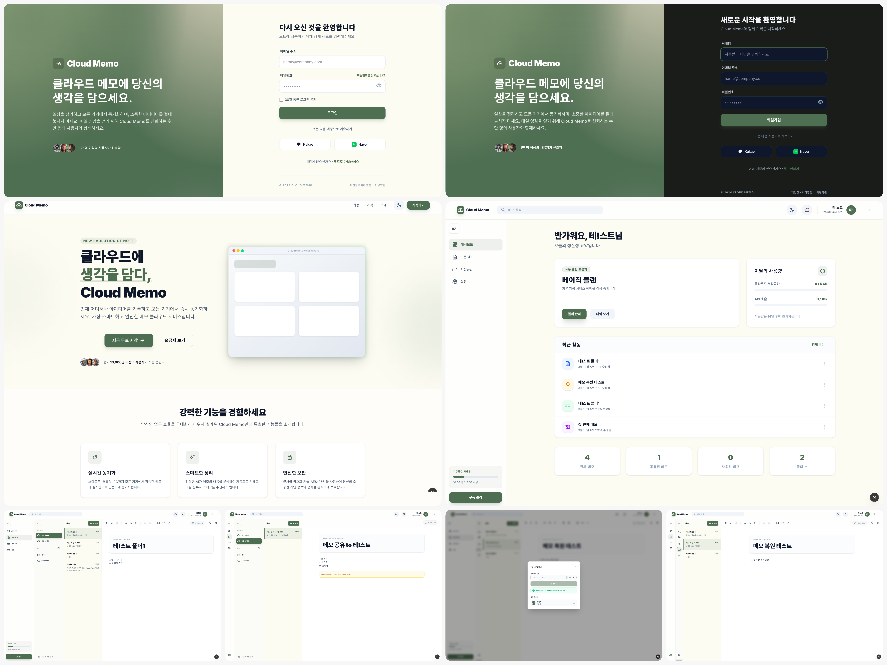
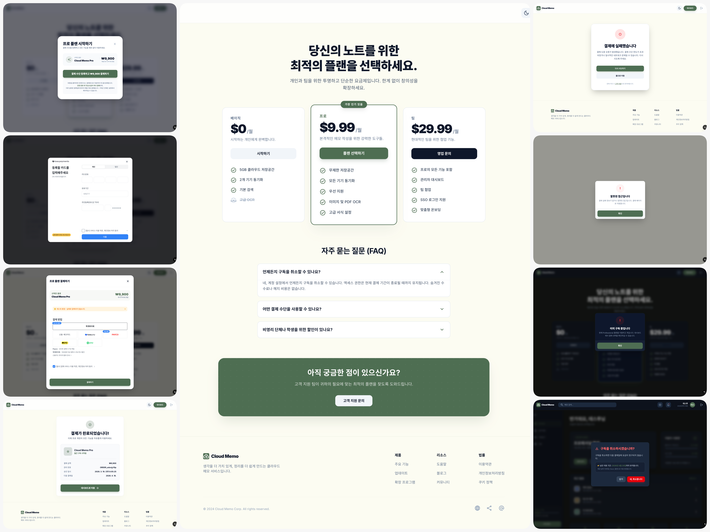

# ☁️ Cloud Memo (클라우드 메모)

> **"생각을 클라우드에 담다"** — 개인 및 팀을 위한 메모 관리 SaaS 솔루션

Cloud Memo는 단순한 메모 작성을 넘어, 강력한 실시간 동기화, 그리고 안전한 정기 결제 시스템을 갖춘 메모 관리 SaaS 플랫폼입니다.

---

## 📸 Preview



---

## 🔥 Key Features

### 1. 지능형 메모 에디터 & 관리
- **Rich Text Editor**: 텍스트 서식, 불릿, 체크리스트, 코드 블록 지원
- **폴더 계층 구조**: 사용자 정의 폴더를 통한 체계적인 메모 분류
- **실시간 동기화**: 모든 기기에서 즉각적으로 반영되는 오프라인 우선 아키텍처

### 2. 고도화된 정기 결제 시스템 (TossPayments)
- **비인증 정기 결제**: 토스페이먼츠 v2 API 개별 연동을 통한 빌링키 기반 자동 결제 구현
- **카드 등록 자동화**: 사용자 친화적인 카드 등록 인터페이스 및 첫 결제 즉시 승인 로직
- **보안 중심 설계**: 결제 로그(PENDING/SUCCESS/FAILED/CANCELLED)를 통한 철저한 트랜잭션 추적

### 3. 자동화된 배치 프로세스 (Vercel Cron)
- **매일 오전 10시(KST) 결제**: 오늘 결제일인 모든 Pro 구독자를 대상으로 자동 결제 실행
- **KST 기준 스케줄링**: UTC 환경에서도 한국 표준시에 맞춰 결제일 및 배치 타임 최적화
- **자동 권한 관리**: 구독 해지 예약 시스템 및 만료 시 자동 다운그레이드 프로세스 구축

### 4. 차세대 보안 및 인증
- **다중 인증 지원**: 이메일/비밀번호 및 소셜 로그인(준비 중)
- **RLS (Row Level Security)**: Supabase RLS 및 Service Role을 활용한 철저한 데이터 격리 및 시스템 권한 분리

---

## 🌐 SEO & Branding

프로젝트의 검색 엔진 최적화(SEO)와 브랜드 아이덴티티 강화를 위해 다음과 같은 설정을 적용했습니다.

### 1. 메타데이터 최적화
- **Dynamic Metadata**: Next.js App Router의 `Metadata` API를 사용하여 각 페이지에 최적화된 제목, 설명, 키워드를 제공합니다.
- **SEO 친화적 구조**: 서비스 슬로건("생각을 클라우드에 담다")을 활용한 타이틀과 설명을 통해 검색 노출 가능성을 높였습니다.

### 2. 소셜 공유 (OG/Twitter)
- **Open Graph**: 페이스북, 카카오톡 등 SNS 공유 시 서비스의 핵심 가치를 보여주는 고해상도 이미지(`og-image.png`)와 함께 서비스 정보를 제공합니다.
- **Twitter Cards**: 트위터 환경에 최적화된 `summary_large_image` 카드를 적용하여 트래픽 유입을 극대화합니다.

### 3. 브랜드 자산 (Icons)
- **크로스 플랫폼 대응**: 브라우저 탭용 `favicon.png`와 iOS/Android 홈 화면 추가용 `apple-touch-icon.png`를 배치하여 모든 기기에서 일관된 브랜드 경험을 제공합니다.

---

## 🛠 Tech Stack

- **Frontend**: `Next.js 15 (App Router)`, `Tailwind CSS`, `TypeScript`
- **Backend/DB**: `Supabase` (Auth, Database, Storage)
- **Payment**: `TossPayments v2 SDK & API`
- **Infrastructure**: `Vercel` (Hosting, Cron Jobs, Serverless Functions)
- **Testing**: `Jest` (TDD 기반 백엔드 로직 검증)

---

## 🚀 Technical Challenges & Solutions

### Q: UTC 서버 환경에서 어떻게 정확한 KST 정기 결제 시간을 준수했나요?
**A**: Vercel Cron은 UTC 기반으로 작동합니다. 이를 KST 오전 10시와 맞추기 위해 헬퍼 함수를 통해 UTC 날짜에 오프셋을 직접 계산하고, `vercel.json`에서 `0 1 * * *` (UTC 01:00 = KST 10:00) 스케줄을 적용했습니다. 또한 DB의 결제 예정일도 KST 00:00:00 기준으로 정규화하여 처리했습니다.

### Q: 비인증 결제 호출 시 보안과 권한 문제는 어떻게 해결했나요?
**A**: 크론 API는 사용자 세션이 없어도 실행되어야 합니다. Vercel 전용 `CRON_SECRET` 헤더를 통해 무단 접근을 차단하고, DB 작업 시에는 `service_role` 키를 사용하는 별도의 Admin Client를 구축하여 RLS 제약을 우회하면서도 시스템 안정성을 확보했습니다.

### Q: 안정적인 결제 로그 관리를 어떻게 구현했나요?
**A**: 모든 결제 시도는 실행 전 `PENDING` 로그를 먼저 생성합니다. 이후 API 응답 결과(성공/실패/취소)에 따라 트랜잭션 내에서 상태를 업데이트하여, 네트워크 장애나 예외 상황에서도 결제 누락이나 중복 청구가 발생하지 않도록 설계했습니다.

---

## 📂 Project Structure

```text
/app
  /api/cron/billing  # 정기 결제 스케줄러 엔드포인트
  /dashboard         # 메인 대시보드 및 구독 관리
  /payment           # 빌링키 등록 및 결제 로직
  /notes             # 메모 작성 및 관리
/utils
  /supabase          # 클라이언트 및 어드민 클라이언트 설정
/supabase            # DB 스키마 및 RLS 정책
vercel.json          # 요금제 스케줄링 설정
```

---

## ⚙️ Installation & Setup

1. Repository 클론 및 종속성 설치
   ```bash
   npm install
   ```
2. `.env.local` 환경 변수 설정
   - `NEXT_PUBLIC_TOSS_CLIENT_KEY`, `TOSS_SECRET_KEY`
   - `NEXT_PUBLIC_SUPABASE_URL`, `NEXT_PUBLIC_SUPABASE_ANON_KEY`, `SUPABASE_SERVICE_ROLE_KEY` (Admin용)
   - `CRON_SECRET` (Vercel Cron 보안용)
3. 빌드 및 실행
   ```bash
   npm run build
   npm run dev
   ```
